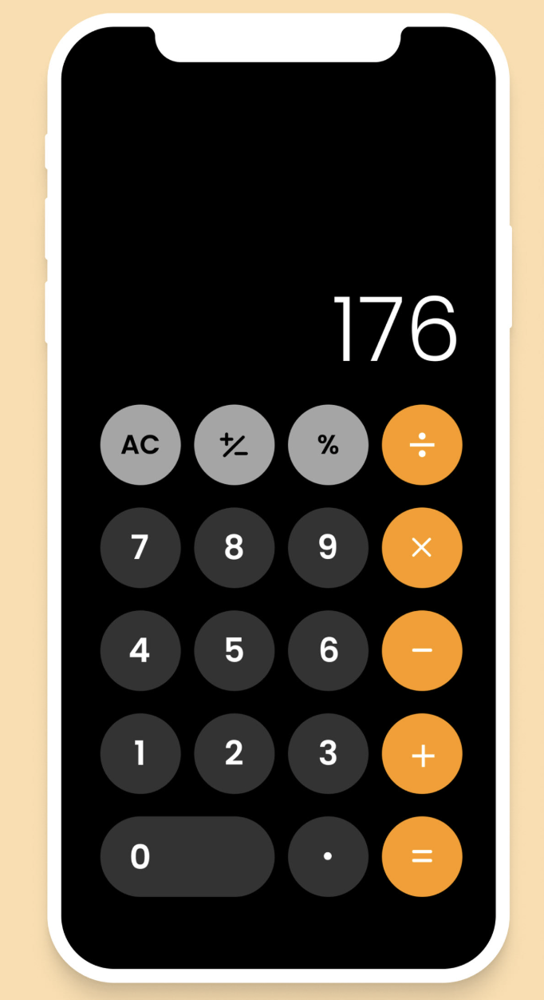

# TP7 : React

## Objetivo: Realizar una calculadora funcional

Para ello, debe modificar el archivo `calculadora.html`.

La misma debe ser funcional y debe verse igual al modelo.

> Fecha límite: Viernes 27, 20 hs.

> Nota:

[Ver resultados de 2do parcial](RESULTADOS.md)